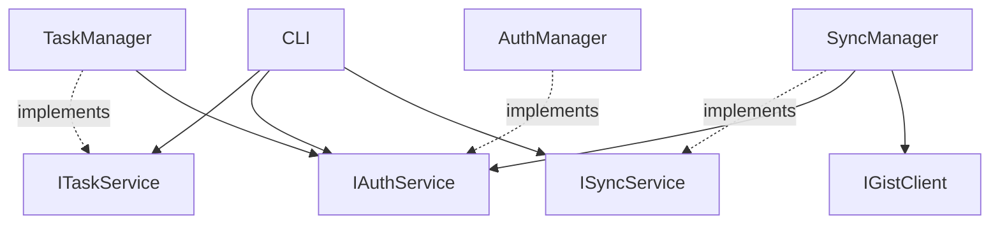

# 📝 TodoCLI - Developer Task Manager

[](https://dotnet.microsoft.com/)
[](https://opensource.org/licenses/MIT)
[]()

A simple yet powerful command-line task manager designed specifically for .NET developers to track small tasks for their next commit. Built with modern C# practices, Clean Code principles, and Test-Driven Development.

## 🎯 Purpose

TodoCLI solves a common developer problem: keeping track of small tasks that need to be completed before the next commit. Whether it's "fix validation bug", "update documentation", or "refactor login method", TodoCLI provides a simple, GitHub-integrated solution that syncs across all your development environments.

## ✨ Features

- 🚀 **Lightning fast** - Optimized performance with 24h authentication cache
- 🔗 **GitHub Gists integration** - Your tasks sync everywhere
- 🎨 **Clean CLI interface** - Custom-built command parser with intuitive UX
- 🔐 **Secure authentication** - GitHub token-based auth with persistent cache
- 📱 **Cross-platform** - Windows, Linux, macOS support
- 🌐 **Offline capable** - Local persistence, syncs when available
- ⚡ **Zero dependencies** - Pure .NET 8.0, no external libraries

## 🏛️ Architecture

This project implements a **Simple Modular Design** architecture, balancing maintainability with simplicity:

### 📂 Project Structure
```
├── src/                    # Source code
│   ├── Auth/              # Authentication module
│   ├── Tasks/             # Task management (core business logic)
│   ├── Sync/              # GitHub Gists synchronization  
│   ├── CLI/               # Command-line interface
│   └── Program.cs         # Application entry point
├── tests/                 # Unit and integration tests
├── docs/                  # Architecture & design documentation
│   ├── requirements.md    # Functional & non-functional requirements
│   ├── use-cases.md       # Detailed use case specifications
│   ├── domain-analysis.md # Domain modeling and business rules
│   ├── architecture-decision.md # Architectural decisions and rationale
│   ├── class-identification.md  # OO analysis and class design
│   └── crc-cards.md       # Class-Responsibility-Collaborator cards
└── README.md              # This file
```

### 🔗 Module Dependencies
Following **Dependency Inversion Principle**:



## 📦 Installation

Install TodoCLI as a global .NET tool:

```bash
# Install from NuGet (recommended)
dotnet tool install -g TodoCLI

# Or update if already installed
dotnet tool update -g TodoCLI
```

## 🚀 Quick Start

### Basic Usage
```bash
# Setup GitHub authentication
todo auth setup

# Add a task
todo add "Fix login validation bug"

# List all tasks  
todo list
# Output:
# You have 2 task(s):
# abc [ ] Fix login validation bug
# def [X] Update documentation

# Mark task as completed
todo done abc

# Remove a task
todo rm def

# Sync with GitHub Gists
todo sync
```

## 🧪 Development Methodology

This project follows **Test-Driven Development (TDD)** practices:

### 🔄 TDD Process
1. **🔴 Red** - Write a failing test
2. **🟢 Green** - Write minimal code to pass the test
3. **🔵 Refactor** - Improve code while keeping tests green
4. **📋 Repeat** - Continue for each feature

### 🎨 Object-Oriented Analysis & Design

The project was developed using comprehensive OOA&D methodology:

1. **📋 Requirements Analysis** - Gathered functional and non-functional requirements
2. **🎭 Use Case Modeling** - Detailed user interaction scenarios
3. **🏗️ Domain Analysis** - Identified business concepts and rules
4. **🏛️ Architecture Design** - Selected appropriate architectural pattern
5. **🃏 Class Design** - Used CRC Cards and class identification techniques
6. **🔗 Interface Design** - Applied SOLID principles for clean abstractions

> 📚 **Full documentation** available in the [`docs/`](./docs) directory

## 🛠️ Technology Stack

- **Framework**: .NET 8.0
- **CLI Framework**: Custom command parser (zero external dependencies)
- **Testing**: xUnit, Moq, FluentAssertions
- **HTTP Client**: System.Net.Http
- **Serialization**: System.Text.Json
- **Architecture**: Simple Modular Design with Dependency Injection
- **Performance**: 24h authentication cache, ~1.2s execution time

## 🧪 Testing

```bash
# Run all tests
dotnet test

# Run with coverage
dotnet test --collect:"XPlat Code Coverage"

# Run specific test category
dotnet test --filter Category=Unit
dotnet test --filter Category=Integration
```

### Test Categories
- **Unit Tests** - Individual class/method testing
- **Integration Tests** - Module interaction testing  
- **E2E Tests** - Full application workflow testing

## 📖 Command Reference

| Command | Description | Example |
|---------|-------------|---------|
| `todo add "task"` | Add new task | `todo add "Fix bug in login"` |
| `todo list` | Show all tasks | `todo list` |
| `todo done <hash>` | Mark task completed | `todo done abc` |
| `todo rm <hash>` | Remove task | `todo rm abc` |
| `todo done-all` | Complete all tasks | `todo done-all` |
| `todo rm-all` | Remove all tasks | `todo rm-all` |
| `todo sync` | Sync with GitHub | `todo sync` |
| `todo auth setup` | Configure GitHub auth | `todo auth setup` |

## 🤝 Contributing

1. Fork the repository
2. Create a feature branch (`git checkout -b feature/amazing-feature`)
3. Follow TDD practices - write tests first!
4. Ensure all tests pass (`dotnet test`)
5. Commit your changes (`git commit -m 'Add amazing feature'`)
6. Push to the branch (`git push origin feature/amazing-feature`)
7. Open a Pull Request

### Development Guidelines
- ✅ Write tests before implementation (TDD)
- ✅ Follow SOLID principles
- ✅ Maintain high code coverage (>90%)
- ✅ Use meaningful commit messages
- ✅ Update documentation as needed

## 📄 License

This project is licensed under the MIT License - see the [LICENSE](LICENSE) file for details.

## 🙏 Acknowledgments

- **GitHub** for providing the Gists API and excellent developer tools
- **.NET Community** for excellent tooling and practices
- **TDD Community** for promoting quality-driven development

## 📞 Support

- 📖 **Documentation**: See [`docs/`](./docs) directory
- 🐛 **Bug Reports**: Use GitHub Issues
- 💬 **Discussions**: Use GitHub Discussions
- 📧 **Contact**: [contact@guilhermedalmeida.dev](mailto:contact@guilhermedalmeida.dev)

---

> **Made with ❤️ for developers by developers**
> 
> *Keeping your commits clean, one task at a time*
